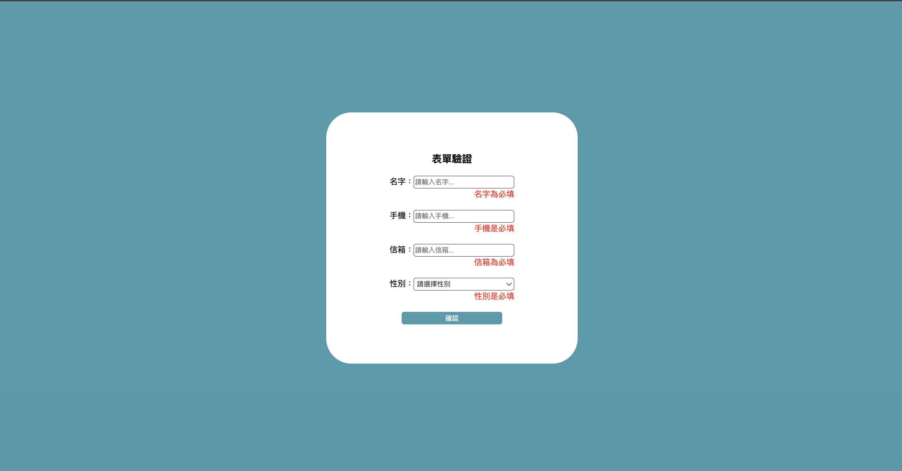

# A simple Form Validation

## 📋 Description

A simple Form Validation with React.

- Name,phone,email,and select gender.
- Form validation uses react-hook-form and Yup.
- When sending successfully, use sweetalert2.

## 🛠️ Technologies & Requirements

- React (18)
- Next.js(14)
- react-hook-form
- yup
- sweetalert2

## 💻 Demo Screenshot




## 🚀 Getting Started

1. Install the packages

```
$ npm install
```

2. Run the server

```
$ npm run dev
```

3. Open http://localhost:3000 to view it in your browser.

## 👤 Author

Email:yiting536@gmail.com

## ⭕️ Warning

This is purely for practice and not for any profit-making purpose.Thanks!
